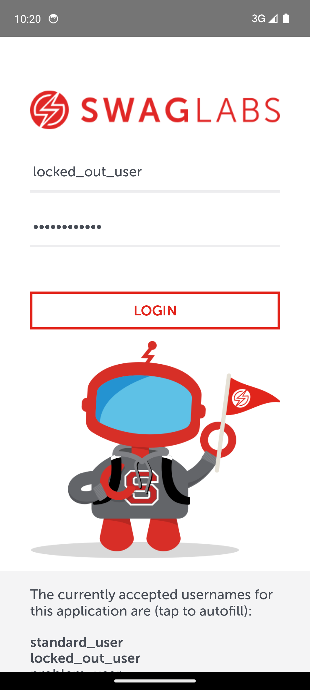

# Sauce Labs Mobile Automation

[](https://github.com/MateiSapunaru/SauceLabsMobileAutomation/actions/workflows/ci.yml)

Appium and pytest test suite for Android, written against Sauce Labs' official sample mobile application. Covers login (valid and invalid credentials) and the product browsing and cart flow, with a Page Object Model structure and a GitHub Actions pipeline that runs the full suite on a hardware accelerated Android emulator on every push.

## Application under test

The suite runs against [saucelabs/sample-app-mobile](https://github.com/saucelabs/sample-app-mobile), Sauce Labs' own demo application, purpose built for Appium practice. Its UI elements carry explicit accessibility identifiers (`test-Username`, `test-LOGIN`, and so on) meant to make automation straightforward, and the login screen itself lists the accepted test users and shared password directly in the UI.

The repository is archived on GitHub. The last tagged release (2.7.1) is from November 2020, and the last non-documentation commit is from mid 2021. This is a deliberate choice rather than an oversight: the application is a fixed, stable target that will not change or break underneath the test suite for reasons outside of this project's control, which matters more for a demonstration suite than an actively maintained upstream would. The APK used for testing is downloaded directly from the project's GitHub Releases page rather than committed to this repository.

## Stack and reasoning

- **Python** with the official **Appium-Python-Client** and **pytest** as the test runner. pytest fixtures handle Appium server lifecycle and driver session setup/teardown cleanly, and `pytest.mark.parametrize` is used for the multiple invalid-login scenarios.
- **Page Object Model**, with a `BasePage` providing a shared explicit-wait helper (`WebDriverWait` plus `expected_conditions`) rather than relying on bare `find_element` calls or fixed sleeps.
- **GitHub Actions** with a Linux runner and a hardware accelerated Android emulator, instead of a hosted device farm. See the Continuous Integration section below for the reasoning.

## Project structure

```
.
├── .github/workflows/ci.yml     GitHub Actions pipeline
├── apps/                        downloaded APK, not committed (see .gitignore)
├── pages/
│   ├── base_page.py             shared explicit-wait helper
│   ├── login_page.py            login screen locators and actions
│   ├── products_page.py         product listing, add to cart, cart badge
│   └── cart_page.py             cart contents
├── tests/
│   ├── conftest.py              Appium server and driver fixtures
│   ├── test_login_smoke.py      sanity check that the app launches
│   ├── test_login.py            valid and invalid login
│   └── test_cart.py             product browsing and cart
├── pytest.ini
└── requirements.txt
```

## Local setup

### 1. Android SDK and emulator

Install [Android Studio](https://developer.android.com/studio). During setup, choose the Standard installation type, which installs the Android SDK, `adb`, the emulator, and a bundled JDK.

Open Android Studio, go to **Tools > Device Manager**, and create a virtual device:

- Device: Pixel 6
- System image: API 34, Google APIs, x86_64
- Accept the default AVD name (used below as `Pixel6_API34`, or adjust `AVD_NAME` in `tests/conftest.py` to match whatever name you choose)

Boot the emulator once from Device Manager and confirm it reaches the home screen before continuing.

### 2. Node.js and Appium

The Appium server itself runs on Node.js, independent of the Python client.

```bash
npm install -g appium
appium driver install uiautomator2
```

### 3. Python environment

```bash
python -m venv .venv
.venv\Scripts\activate      # on Windows
source .venv/bin/activate   # on macOS/Linux
pip install -r requirements.txt
```

### 4. The application APK

Download the Android build from the [sample-app-mobile releases page](https://github.com/saucelabs/sample-app-mobile/releases) and place it at `apps/Android.SauceLabs.Mobile.Sample.app.2.7.1.apk`. This path is what `tests/conftest.py` expects.

### 5. Running the tests

With the emulator booted:

```bash
pytest tests/ -v
```

`tests/conftest.py` starts and stops the Appium server itself through `AppiumService`, so there is no separate `appium` process to manage by hand.

## Test coverage

**Login** (`tests/test_login.py`)

- Valid login with `standard_user` reaches the products screen.
- Invalid login, parametrized over two distinct failure modes: `locked_out_user`, which the application specifically designates as a blocked account and returns a business rule error for, and a genuinely unrecognized username and password pair, which returns a different, generic error message.

**Product browsing and cart** (`tests/test_cart.py`)

- The products screen lists the expected product titles.
- Adding a specific named product to the cart (not simply "whichever button is first") updates the cart badge count and the product appears on the cart page.

**Smoke test** (`tests/test_login_smoke.py`)

- The application launches and the login screen renders. Kept separate from the behavioral login tests as a fast environment sanity check.

All credentials, error message text, and product names used in assertions were taken directly from the running application (via `uiautomator dump` and Appium's own `page_source`), not assumed or guessed from documentation.

## Issues found and fixed while building this suite

**Splash screen activity mismatch.** The application's manifest declared launcher activity is `SplashActivity`, which redirects to `MainActivity` roughly one to two seconds after launch. Appium's default session startup waits for the exact launcher activity to remain the resumed activity, and failed because by the time it checked, the application had already moved on. Fixed by setting `appWaitActivity` to a wildcard (`com.swaglabsmobileapp.*`) covering both activities.

**Assertions against elements that had not rendered yet.** Even with the activity wait fixed, a session could start while the application was still on the splash screen. A bare `find_element` call immediately after session start would hit that half rendered state. Fixed with an explicit `WebDriverWait` based wait in `BasePage`, used throughout the page objects instead of unconditional `find_element` calls.

**Text living in unlabeled child elements.** Both the login error message and the cart item count badge are structured the same way: the element carrying the accessibility identifier (`test-Error message`, `test-Cart`) has no text of its own, and the actual text is in an unlabeled child `TextView`. Calling `.text` on the labeled element silently returns an empty string rather than raising an error, which would make a naive assertion fail in a confusing way. Fixed with an XPath descendant selector into the child element in both cases.

**adb and Appium timeouts under CI load.** The first GitHub Actions run failed every test at session setup. Installing Appium's own `uiautomator2-server` companion APK hit the default 20 second `adbExecTimeout`, because the shared CI runner is measurably slower than local development hardware. Raised to 60 seconds, along with `androidInstallTimeout` after a plain `adb install` of the application itself also exceeded its 90 second default on the runner once.

**Headless emulator instability on Android 13 and 14.** After fixing the timeouts above, CI hit a separate, unresolved upstream issue ([appium/appium#20074](https://github.com/appium/appium/issues/20074)): a headless Android 13 or 14 emulator fails an internal Appium readiness check for a companion "Settings" application, with no confirmed fix at the time of writing. The local development AVD never encountered this because it is not headless. CI now targets API 30 instead of API 34, which the application, itself built years before API 34 existed, has no issue running on.

**Missing KVM permissions on the CI runner.** After the API level change, a subsequent run still failed, this time with the emulator's own system server crashing partway through boot. The actual cause was unrelated to API level or device profile: `reactivecircus/android-emulator-runner` requires an explicit step granting the CI runner access to `/dev/kvm` on Linux, documented in the action's own README but easy to overlook. Without it, the emulator silently falls back to fully software emulated CPU virtualization instead of hardware acceleration, which explained both the six-plus minute boot times observed in CI (roughly one minute locally) and the crashes under sustained load. Adding the KVM permission step resolved both issues at once, and the workflow run time dropped from over twenty minutes to under four.

## Continuous integration

The pipeline in `.github/workflows/ci.yml` runs on `ubuntu-latest`, boots a hardware accelerated Android emulator using `reactivecircus/android-emulator-runner`, and runs the full pytest suite against it on every push and pull request to `main`.

This intentionally does not use a cloud device farm, for a few concrete reasons:

- **Firebase Test Lab does not support Appium.** Its `gcloud firebase test android run` command only executes Espresso, UI Automator 2, Robo, and Game Loop tests, all of which run self-contained on the device. There is no way to point an external Appium WebDriver session at a Firebase Test Lab device.
- **AWS Device Farm and BrowserStack do support Appium**, but neither is free for ongoing use. AWS Device Farm gives a one-time 1,000 minute trial and then bills per device minute. BrowserStack's unlimited access requires applying to and being accepted into its Open Source Program, which is not something a CI pipeline can depend on with certainty.
- **A self-hosted, KVM-accelerated emulator in the CI runner itself has none of those dependencies.** It uses GitHub's own Actions minutes, requires no third party account, and cannot run out of a trial allowance partway through the project.

The trade-off is real device coverage and parallel execution across many devices at once, which a proper device farm provides and a single CI-hosted emulator does not. For a project of this scope, a deterministic, zero-cost pipeline was judged more valuable than that coverage.

## Screenshot



Sample application running on the local Pixel 6, API 34 emulator described above.

## Possible extensions

- A cross-device or cross-OS-version test to demonstrate parametrizing over multiple emulator configurations, deliberately left out of the initial scope to keep the suite focused.
- iOS coverage, using the same application's iOS build and the corresponding Appium XCUITest driver.
